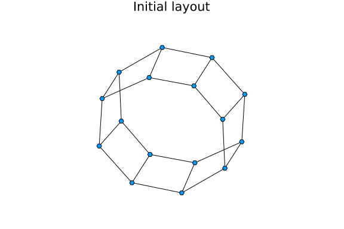
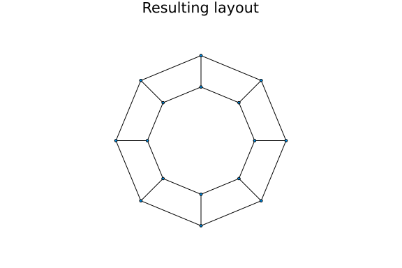

# SOR Iteration for Sparse Matrices
**Alen Kurtagić**

# Sparse matrix
A matrix is typically represented in a dense format as a two-dimensional array.  
However, in many applications most of the entries are zero. Storing every element explicitly is inefficient, both in terms of memory consumption and computational cost.  
A sparse matrix representation addresses this issue by storing only the nonzero entries and their indices.  
In addition to saving memory, sparse representations also help reduce *fill-in* during numerical algorithms such as factorization and iterative methods.

Several established storage formats for sparse matrices include:

- DOK (Dictionary of Keys) – a dictionary keyed by `(row, col)` pairs  
- COO (Coordinate List) – arrays of `(row, col, value)` triplets  
- CSR/CSC (Compressed Sparse Row/Column) – compact formats optimized for fast arithmetic operations  
- LIL (List of Lists) – one list per row, storing column indices and values  

In this project, we implemented the LIL (List of Lists) format.  LIL is well suited for our needs of efficient matrix-vector multiplication (required later for the SOR method).

In the LIL format, each row of the matrix is represented by two lists:

- List ($V[i]$) contains the nonzero values in row $i$.  
- Another list ($I[i]$) contains the corresponding column indices of those values.  

Since different rows can contain different numbers of nonzeros, the lists may vary in length.  
Formally, for a matrix $A \in \mathbb{R}^{n \times n}$, the representation satisfies

$$
V[i][k] \;=\; A\!\bigl(i,\, I[i][k]\bigr),
$$

meaning that the $k$-th element of the list $V[i]$ corresponds to the entry of $A$ at row $i$ and column $I[i][k]$.

To make the sparse matrix type usable in Julia, we extended several standard functions:

- `getindex(A, i, j)` – retrieve element $A_{ij}$  
- `setindex!(A, v, i, j)` – assign element $A_{ij} \gets v$  
- `size(A)` – return the dimensions of the matrix  
- `*(A, x)` – multiplication with a dense vector  

The most subtle design decision arises in `setindex!`.  
For example, when assigning a zero value, one must decide whether to remove the entry from the sparse structure or store it explicitly.  
Since our implementation is intended for internal use rather than as a general-purpose library, we chose the simpler option: zero values are stored explicitly, without removing entries. This keeps the implementation straightforward.


# Successive Over-Relaxation (SOR)
The SOR method is an iterative technique for solving linear systems

$$
A x = b,
$$

where $A \in \mathbb{R}^{n \times n}$ is typically large and sparse. 

SOR can be viewed as an extension of the Gauss–Seidel method with an additional relaxation parameter $\omega$, where:
- when $\omega = 1$ reduces to Gauss–Seidel 
- when $0 < \omega < 1$ corresponds to under-relaxation 
- when  $1 < \omega < 2$ corresponds to over-relaxation 

We adapted the SOR iteration to work with our custom sparse matrix representation.


# Embedding Graphs with the Physical Method

One of the applications of iterative solvers such as SOR is in graph embedding into the plane or space. In this method, vertices of a graph are treated as physical points connected by springs, and their positions are determined by solving a system of linear equations derived from equilibrium conditions. 

The goal is to assign each vertex a coordinate in $\mathbb{R}^2$ (or $\mathbb{R}^3$) such that the embedding reflects the graph structure.  
Some vertices (called anchors) are fixed at predetermined positions, while the remaining vertices are placed by minimizing the spring energy.  
This leads to a sparse linear system, which is particularly well-suited for solution by SOR.

This is represented with a Laplacian matrix, which is sparse for most graphs. Laplacian matrix represents discrete analog of the continuous Laplace operator, capturing the connectivity of the graph.  

Consider the circular ladder graph with 8 rungs:


```julia
using Dn01
G = circularLadder(8)

using GraphRecipes, Plots
graphplot(G, curves = false, title = "Initial layout")
```




We fix the outer 8 vertices equally spaced on a circle and compute the positions of the inner vertices by solving the equilibrium equations.  
The embedding produces a visually symmetric layout, where the fixed boundary controls the geometry.


```julia
t = range(0, 2pi, 9)[1:end-1]
x = cos.(t)
y = sin.(t)
points = hcat(hcat(x, y)', zeros(2, 8))
fix = 1:8

k = embed!(G, fix, points)

p2 = graphplot(G, x = points[1, :], y = points[2, :], curves = false, title = "Resulting layout")
```




## Optimal Relaxation Parameter $\omega$

The efficiency of the SOR solver depends critically on the choice of the relaxation parameter $\omega$.  
To determine the optimal value, we sweep $\omega$ over the interval $[0.0, 2.0]$ and record the number of iterations required to reach convergence for the above graph embedding problem.

```julia
using Dn01, Graphs, GraphRecipes, Plots

t = range(0, 2pi, 9)[1:end-1]
x = cos.(t)
y = sin.(t)
points = hcat(hcat(x, y)', zeros(2, 8))
fix = 1:8

ws = 0.1:0.05:1.9
iters = Float64[]

for w in ws
    try
        k = embed!(G, fix, points; ω=w)
        push!(iters, k)
    catch
        push!(iters, 0)
    end
end

# Plot convergence behaviour
plot(ws, iters,
     xlabel="ω",
     ylabel="Iterations",
     title="SOR Convergence ",
     legend=false,
     lw=2,
     marker=:circle)
```


```julia
# Find optimal ω (ignoring NaNs)
imin = argmin(iters)                # index of smallest value
ω_opt = ws[imin]                    # corresponding ω
iters_opt = iters[imin]             # iteration count

println("Optimal ω ≈ $ω_opt with $iters_opt iterations.")
```

```
Optimal ω ≈ 1.15 with 22.0 iterations.
```


In our experiments, the optimal parameter was found near $\omega \approx 1.15$, reducing the iteration count to about 22.  