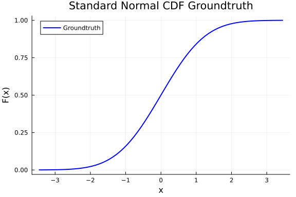
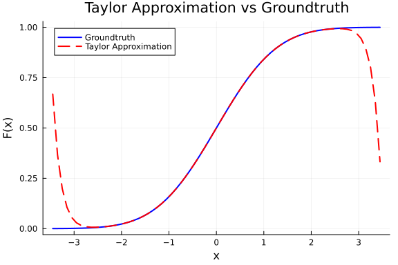
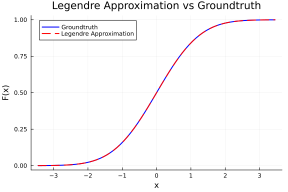
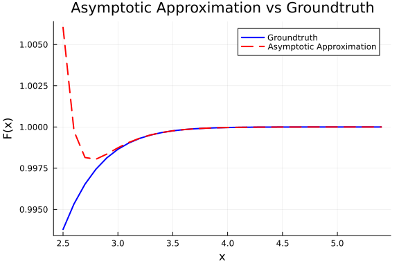

# Efficient Computation of the CDF of the Normal Distribution
**Alen Kurtagić**

# CDF of the Normal Distribution
The cumulative distribution function (CDF) of a random variable $X$ is defined as

```math
F_X(x) = P(X \leq x) = \int_{-\infty}^{x} f_X(t) \, dt,
```

where $f_X(t)$ is the probability density function (PDF) of $X$. The CDF gives the probability that $X$ takes a value less than or equal to $x$.

For the normal distribution $N(\mu, \sigma^2)$, the PDF is

```math
f_X(x) = \frac{1}{\sqrt{2\pi\sigma^2}} \exp\!\left(-\frac{(x - \mu)^2}{2\sigma^2}\right).
```

In particular, for the standard normal distribution $N(0,1)$, we have

```math
f_X(x) = \frac{1}{\sqrt{2\pi}} \exp\!\left(-\frac{x^2}{2}\right).
```

The corresponding CDF is

```math
F(x) = \frac{1}{\sqrt{2\pi}} \int_{-\infty}^{x} e^{-t^2/2} \, dt.
```


```julia
using Plots

using Distributions
Φ(x) = cdf(Normal(0,1), x)

xs = -3.45:0.1:3.45
truevals = [Φ(x) for x in xs]

plot(xs, truevals, label="Groundtruth", lw=2, color=:blue)
xlabel!("x")
ylabel!("F(x)")
title!("Standard Normal CDF Groundtruth")
```




The standard normal distribution is especially important because any normal distribution can be transformed into it. If $X \sim N(\mu, \sigma^2)$, then the standardized variable

```math
Z = \frac{X - \mu}{\sigma}
```

follows the standard normal $N(0,1)$. Thus, computing probabilities for *any* normal distribution reduces to evaluating the CDF of $N(0,1)$, which makes it the universal building block for all normal CDF calculations.

# Splitting the Domains

The standard normal CDF has no closed-form expression in elementary functions. Our numerical computation of $F(x)$ must satisfy:

- High precision (relative error ≤ $10^{-10}$).  
- Uniform computational complexity across the domain.  

Direct quadratures (e.g., Newton–Cotes and Gauss rules) are inefficient, since larger $x$ would require more integration steps. Instead, the domain is split into regions:

- Near 0: Taylor expansion of $\mathrm{erf}(x)$.  
- Moderate values (2 ≤ x ≤ 5): Gauss–Legendre quadrature (fixed steps).  
- Large $x > 5$: Asymptotic expansion.  

We can also take advantage of the symmetry of the normal distribution:

```math
F(-x) = 1 - F(x).
```


# Taylor Expansion of the Error Function

The error function is defined as

```math
\mathrm{erf}(x) = \frac{2}{\sqrt{\pi}} \int_0^x e^{-t^2}\,dt,
```

and is directly related to the standard normal CDF by

```math
F(x) = \tfrac{1}{2}\big(1 + \mathrm{erf}(x/\sqrt{2})\big).
```

Expanding $e^{-t^2}$ as a Maclaurin series and integrating term by term yields the series representation

```math
\mathrm{erf}(x) = \frac{2}{\sqrt{\pi}} \sum_{n=0}^{\infty} \frac{(-1)^n}{n!\,(2n+1)}\, x^{2n+1}.
```


This series is mathematically valid for all $x$, but when truncated to finitely many terms it only converges quickly near the origin, as shown below with 10 terms.

```julia
using Dn02
using Plots

# Plot the Taylor CDF approximation against the true one from Distributions.jl
using Distributions
Φ(x) = cdf(Normal(0,1), x)

xs = -3.45:0.1:3.45
approx = [cdf_taylor(x, terms=10) for x in xs]
truevals = [Φ(x) for x in xs]

plot(xs, truevals, label="Groundtruth", lw=2, color=:blue)
plot!(xs, approx, label="Taylor Approximation", lw=2, ls=:dash, color=:red)
xlabel!("x")
ylabel!("F(x)")
title!("Taylor Approximation vs Groundtruth")
```




# Gauss–Legendre Quadrature
For moderate arguments ($2 \leq |x| \leq 5$), we approximate the standard normal CDF with one step

```math
F(x) = \frac{1}{\sqrt{2\pi}} \int_{-\infty}^x e^{-t^2/2}\,dt
```

using Gauss–Legendre quadrature. The idea is to transform the integral to a fixed finite interval, then approximate it by a weighted sum of function evaluations:

```math
\int_{a}^{b} f(t)\,dt \;\approx\; \sum_{i=1}^{n} w_i f(t_i),
```

where $t_i$ are the quadrature nodes (roots of Legendre polynomials) and $w_i$ are the corresponding weights. The advantage is that this method achieves high accuracy with relatively few evaluations, keeping the computational cost constant.


In our case, the weight function is simply $w(t) = 1$, which makes Gauss–Legendre the appropriate choice (other Gaussian quadratures such as Gauss–Hermite or Gauss–Laguerre are used when exponential weight functions appear).

To ensure constant-time evaluation, we use a fixed rule (10-point Gauss–Legendre), with nodes and weights obtained from published tables and hardcoded into the implementation. Reliable tables can be found online, e.g.:  
[https://pomax.github.io/bezierinfo/legendre-gauss.html](Gaussian Quadrature Weights and Abscissae).

```julia
using Dn02
using Plots

# Plot the Taylor CDF approximation against the true one from Distributions.jl
using Distributions
Φ(x) = cdf(Normal(0,1), x)

xs = -3.45:0.1:3.45
approx = [cdf_legendre(x, n=10) for x in xs]
truevals = [Φ(x) for x in xs]

plot(xs, truevals, label="Groundtruth", lw=2, color=:blue)
plot!(xs, approx, label="Legendre Approximation", lw=2, ls=:dash, color=:red)
xlabel!("x")
ylabel!("F(x)")
title!("Legendre Approximation vs Groundtruth")
```




# Asymptotic Expansion

For large arguments ($x > 5$), we can use an asymptotic expansion to approximate the standard normal CDF. The idea is to express the CDF in terms of the complementary error function:

```math
F(x) = 1 - \frac{1}{\sqrt{2\pi} x} e^{-x^2/2} \sum_{n=0}^{\infty} \frac{(-1)^n (2n)!}{(2^n n!)^2 (2n+1)} \frac{1}{x^{2n}}.
```

This series converges rapidly for large $x$, allowing us to compute $F(x)$ efficiently without direct integration.

```julia
using Dn02
using Plots

# Plot the Taylor CDF approximation against the true one from Distributions.jl
using Distributions
Φ(x) = cdf(Normal(0,1), x)

xs = 2.5:0.1:5.45
approx = [cdf_asymptotic(x, terms=10) for x in xs]
truevals = [Φ(x) for x in xs]

plot(xs, truevals, label="Groundtruth", lw=2, color=:blue)
plot!(xs, approx, label="Asymptotic Approximation", lw=2, ls=:dash, color=:red)
xlabel!("x")
ylabel!("F(x)")
title!("Asymptotic Approximation vs Groundtruth")
```




# Results


The table below summarizes the performance and accuracy of each method (with 10 terms), benchmarked on an Intel i9-14900K.

| Method      | Avg. Time per x (s)     | Max Absolute Error       | Max Relative Error       |
|-------------|--------------------------|--------------------------|--------------------------|
| Groundtruth | 1.29 × 10⁻⁸             | –                        | –                        |
| Taylor      | 4.76 × 10⁻¹⁴            | 4.91 × 10⁻¹²            | 3.09 × 10⁻¹¹            |
| Legendre    | 2.58 × 10⁻⁸             | 2.38 × 10⁻⁹             | 2.38 × 10⁻⁹             |
| Asymptotic  | 7.32 × 10⁻⁹             | 2.22 × 10⁻¹⁶            | 2.22 × 10⁻¹⁶            |
| Combined    | 1.43 × 10⁻⁸             | 4.91 × 10⁻¹²            | 3.09 × 10⁻¹¹            |

```julia
using Dn02
using Distributions, BenchmarkTools, Statistics

Φ(x) = cdf(Normal(0,1), x)

# pick representative x values for each method
xs_small = collect(-1.15:0.1:1.15)   # good for Taylor
xs_mid   = collect(1.15:0.1:5.0)    # good for Gauss–Legendre
xs_large = collect(6.0:0.1:10.0)   # good for Asymptotic
xs_all   = collect(-1.0:0.1:1.0) # for my_cdf

# benchmark helpers
function avgtime(f, xs; trials=1000)
    t = @belapsed begin
        for x in $xs
            $f(x)
        end
    end evals=1 samples=trials
    return t / length(xs)
end

# error helpers
function max_abs_error(f, xs)
    maximum(abs.(f.(xs) .- Φ.(xs)))
end

function max_rel_error(f, xs)
    maximum(abs.((f.(xs) .- Φ.(xs)) ./ Φ.(xs)))
end

println("Average evaluation time per x (seconds):")
println("My CDF:     ", avgtime(x ->  my_cdf(x), xs_all))
println("Taylor:      ", avgtime(x -> cdf_taylor(x, terms=10), xs_small))
println("Legendre:    ", avgtime(cdf_legendre, xs_mid))
println("Asymptotic:  ", avgtime(x -> cdf_asymptotic(x, terms=10), xs_large))
println("Groundtruth: ", avgtime(Φ, xs_mid))

println("\nMaximum absolute error:")
println("My CDF:     ", max_abs_error(x ->  my_cdf(x), xs_all))
println("Taylor:      ", max_abs_error(x -> cdf_taylor(x, terms=10), xs_small))
println("Legendre:    ", max_abs_error(cdf_legendre, xs_mid))
println("Asymptotic:  ", max_abs_error(x -> cdf_asymptotic(x, terms=10), xs_large))

println("\nMaximum relative error:")
println("My CDF:     ", max_rel_error(x ->  my_cdf(x), xs_all))
println("Taylor:      ", max_rel_error(x -> cdf_taylor(x, terms=10), xs_small))
println("Legendre:    ", max_rel_error(cdf_legendre, xs_mid))
println("Asymptotic:  ", max_rel_error(x -> cdf_asymptotic(x, terms=10), xs_large))
```

```
Average evaluation time per x (seconds):
My CDF:     1.4285714285714284e-8
Taylor:      4.166666666666667e-14
Legendre:    3.076923076923077e-8
Asymptotic:  7.317073170731707e-9
Groundtruth: 1.282051282051282e-8

Maximum absolute error:
My CDF:     4.908295991867817e-12
Taylor:      9.119807686808201e-11
Legendre:    2.3020536588092e-9
Asymptotic:  2.220446049250313e-16

Maximum relative error:
My CDF:     3.093651397663179e-11
Taylor:      7.291649913587276e-10
Legendre:    2.302054513026601e-9
Asymptotic:  2.220446051440978e-16
```


The results highlight the strengths and limitations of each approximation strategy:

- Taylor expansion is extremely fast and accurate near the origin but diverges rapidly for larger $|x|$.  
- Gauss–Legendre quadrature achieves excellent accuracy in the moderate range, but it is the most expensive method in terms of runtime. Its use should therefore be limited to values of $x$ where neither Taylor nor asymptotic expansions perform well.  
- Asymptotic expansionis the most efficient and stable method in the tails, providing machine-precision accuracy with minimal cost.  
- Combined approach (`my_cdf`) switches between these methods depending on the region. With a slight increase in quadrature order (from 10 to 12 points), it achieves the required precision of $10^{-10}$ while maintaining uniform constant-time performance across the domain.  

Thus, the final implementation (`my_cdf`) delivers a robust and efficient solution: it leverages the speed of Taylor near zero, the stability of Gauss–Legendre in the mid-range, and the accuracy of the asymptotic expansion in the tails.