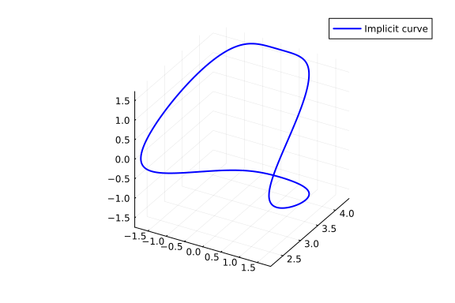

# Curve Length for an Implicitly Defined Curve
**Alen Kurtagić**

# Implicit Curves
In many applications, explicit parametric equations of curves are either unknown or too complicated to work with. A common alternative is to describe a curve implicitly, for example as the intersection of two surfaces.

An implicit surface is defined by a function $F(x,y,z)$, with the surface itself given by the set of points where $F(x,y,z) = 0$. If two such surfaces are defined by
$F_1(x,y,z) = 0$ and $F_2(x,y,z) = 0$, their intersection is, in general, a curve in three-dimensional space.

The gradients
$$
\nabla F_1, \quad \nabla F_2
$$
are normal vectors to the two surfaces. The tangent to the intersection curve must lie in both tangent planes simultaneously, and is therefore perpendicular to both normals. This tangent direction is obtained through the cross product:
$$
\dot{\mathbf{x}}(t) = \nabla F_1(\mathbf{x}(t)) \times \nabla F_2(\mathbf{x}(t)).
$$

This gives a differential equation that describes the motion of a point traveling along the curve. 

Our specific case is the curve defined by
$$
F_1(x, y, z) = x^4 + \tfrac{1}{2} y^2 + z^2 - 12 = 0,
$$
$$
F_2(x, y, z) = x^2 + y^2 - 4z^2 - 8 = 0.
$$

Because no simple parametric form is available, we approximate this curve numerically by integrating the associated ODE and then use the trajectory to estimate its length.

# Integrating with Explicit Euler
We integrate the ODE using the explicit Euler method. Given a current point $u_k$ on the curve and step size $h$, the next point is computed as

$$
u_{k+1} = u_k + h \, \frac{f(u_k)}{\|f(u_k)\|},
$$

where $f(u) = \nabla F_1(u) \times \nabla F_2(u)$. The normalization ensures each step moves along the tangent direction with fixed arc-length increment.

To detect closure of the curve, we monitor the distance back to the starting point $u_0$ and stop when $\|u_k - u_0\|$ is below a tolerance proportional to $h$.

```julia
using Dn03
using Plots

∇F1(x, y, z) = [4x^3, y, 2z]
∇F2(x, y, z) = [2x, 2y, -8z]

u0 = [1.758, 2.215, 0.0]
traj = Dn03.integrate_explicit_euler(u0, 1e-3, ∇F1, ∇F2)

# extract coordinates
xs = [p[1] for p in traj]
ys = [p[2] for p in traj]
zs = [p[3] for p in traj]

# plot
plot3d(xs, ys, zs, seriestype = :line, linewidth = 2, color = :blue, label = "Implicit curve")
```

```
Closed loop detected at step 15127
```





# Curve Length
The algorithm produces a trajectory that traces the implicit intersection curve. The total arc length is approximated by summing distances between consecutive points.

For step size $h$, the length is approximately $L \approx N h$, where $N$ is the number of steps taken before closure.

```julia
curve_length(traj)
```

```
15.126999999996796
```


In this case, the computed length is approximately 15.127 units.